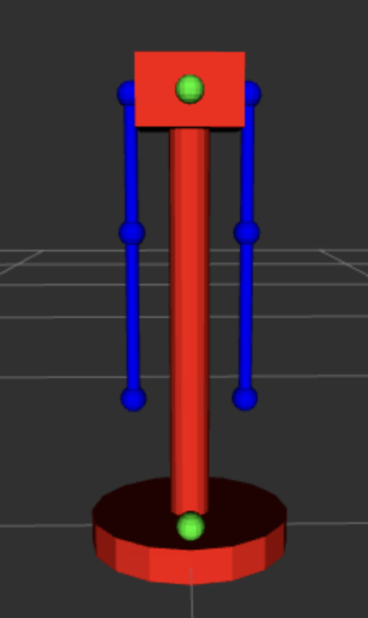

## **Dinamo**: Robô Auxiliar para Tarefas Domésticas

Trabalho de Interação Humano-Robô (IHR) apresentado ao Centro Universitário FEI, como parte dos requisitos necessários para aprovação na disciplina de Interação Humano-Robô (IHR) (CCR230) do curso de Engenharia de Robôs, orientado pelo Prof. Dr. Fagner de Assis Moura Pimentel.

### Componentes do Grupo

Nicolas Alan Grotti Meireles Aguiar RA: 11.120.562-1

### Resumo

O **Dinamo** é um robô auxiliar projetado para realizar tarefas domésticas básicas, como lavar louça, arrumar a cama e varrer o chão, em residências de um único andar. Controlado exclusivamente por um aplicativo, ele utiliza uma câmera estéreo, um manipulador de 6 graus de liberdade (DOF) e uma base omnidirecional para executar atividades de forma autônoma, aprendendo por demonstração humana.

### Introdução

Tarefas domésticas repetitivas, como lavar louça, arrumar a cama e varrer o chão, consomem tempo valioso no dia a dia, apesar de seguirem padrões previsíveis. Em uma sociedade onde a otimização do tempo é cada vez mais valorizada, robôs como o **Dinamo** tornam-se essenciais para aliviar essas responsabilidades. O **Dinamo** é um robô compacto que realiza essas tarefas por meio de comandos via aplicativo, utilizando uma câmera estéreo e um manipulador de 6 DOF para operar de forma autônoma. Seu objetivo é automatizar atividades rotineiras, permitindo que os usuários foquem em prioridades pessoais ou profissionais. A experiência proporcionada pelo **Dinamo** é de praticidade, autonomia e surpresa, com um robô que aprende e se adapta às preferências do usuário.

### Público Alvo

**Perfil de usuário**: Indivíduos entre 20 e 35 anos, com renda média alta, conhecimento em tecnologia, que vivem sozinhos ou com no maximo um companheiro.

### Personas

- **Persona primária**: João, 28 anos, engenheiro de software, mora sozinho em um apartamento. Valoriza a praticidade e busca otimizar seu tempo livre para hobbies ou trabalho.
  - **Informações que o robô deve saber**: Horários disponíveis de João, localização da pia, cama e áreas a varrer, além de suas preferências (ex.: como arrumar a cama).

- **Persona secundária**: Maria, 25 anos, designer, visita amigos que possuem o **Dinamo**. Curiosa sobre tecnologia, mas sem experiência prévia com robôs.

  - **Informações que o robô deve saber**: Nenhuma informação prévia, já que Maria não é a dona do robô; ele deve operar normalmente na presença dela.

### Mapa de Empatia

#### Persona primária (João):

- **O que vê**: Um apartamento organizado, soluções tecnológicas minimalistas e modernas.
- **O que ouve**: Recomendações de amigos sobre *gadgets* e tecnologias úteis.
- **O que diz e faz**: Busca dispositivos que economizem tempo e compartilha suas experiências em redes sociais.
- **O que pensa e sente**: Valoriza praticidade e eficiência; sente satisfação com tecnologias que se adaptam a ele.
- **Dores**: Frustração com dispositivos complexos ou que não atendem suas expectativas.
- **Ganhos**: Tempo livre, qualidade de vida e surpresa ao ver o robô aprender suas preferências.

#### Persona secundária (Maria):

- **O que vê**: O **Dinamo** funcionando na casa de amigos, ambientes limpos e organizados.
- **O que ouve**: Comentários positivos dos amigos sobre o robô.
- **O que diz e faz**: Expressa curiosidade e observa o robô em ação.
- **O que pensa e sente**: Interesse em tecnologia, mas receio de não entender seu funcionamento.
- **Dores**: Insegurança por falta de familiaridade com robôs.
- **Ganhos**: Fascínio ao ver o robô operar autonomamente.

### Contexto de Uso

O **Dinamo** opera em residências de um único andar, como apartamentos ou casas pequenas, sem adaptação para escadas ou elevadores. O ambiente é caracterizado por espaços reduzidos, exigindo um robô pequeno, portátil e capaz de navegar entre diferentes pisos. Socialmente, atende a jovens adultos com estilo de vida moderno; economicamente, é voltado para quem tem renda média e investe em tecnologia; culturalmente, reflete a valorização da praticidade e inovação. O robô deve conhecer a disposição do ambiente (pia, cama, áreas a varrer) e os horários dos usuários antes de iniciar as tarefas.

#### Jornada do Usuário

**Narrativa**: João agenda no aplicativo para o **Dinamo** lavar a louça às 18h. Ele sai para trabalhar, e o robô executa a tarefa autonomamente, notificando João ao finalizar.

**Passo a passo**:
- João abre o aplicativo e agenda "lavar louça às 18h".
- Às 18h, o **Dinamo** se desloca até a pia, usa sua câmera estéreo para identificar louças e as lava com o manipulador.
- Após concluir, o robô envia uma notificação ao aplicativo: "Louça lavada".

**Ambiente**: O apartamento permanece silencioso, com a pia ficando limpa e organizada.
**Interações**:
- **Espacial**: O robô se move até a pia (início) e retorna à base (fim).
- **Não-verbal**: Notificação do aplicativo ao iniciar e finalizar a tarefa.
- **Verbal**: Nenhuma, pois não há interface de voz.

### Análise de Concorrência

- **Tesla – Optimus**:
  - **Similaridade**: Robô para tarefas repetitivas com aprendizado por imitação.
  - **Pontos positivos**: Versatilidade em ambientes industriais e domésticos.
  - **Pontos negativos**: Preço elevado (US$20.000–30.000) e complexidade excessiva para tarefas simples.

- **Figure**:
  - **Similaridade**: Robô humanoide para uso doméstico e industrial.
  - **Pontos positivos**: IA avançada (Helix) e parcerias como com a BMW.
  - **Pontos negativos**: Foco maior em indústria, menos acessível para residências.

- **Hello Robot – Stretch**:
  - **Similaridade**: Robô compacto para tarefas domésticas.
  - **Pontos positivos**: Design acessível, open source, custo razoável (US$24.950).
  - **Pontos negativos**: Menor autonomia e funcionalidades limitadas.

- **Preferência da equipe**: Stretch, por seu foco em acessibilidade e simplicidade, alinhado ao público do **Dinamo**.

### Design

O **Dinamo** é construído com materiais plásticos de baixa rigidez, garantindo segurança ao evitar lesões em caso de contato acidental com o usuário. Seu design utiliza formas geométricas simples, incluindo uma pinça funcional, rodas para mobilidade e um torso básico, projetado com o objetivo principal de oferecer extensibilidade para manipulação de objetos e compacidade para navegação eficiente em ambientes domésticos. O robô apresenta características antropomórficas mínimas, priorizando a funcionalidade para atender às necessidades práticas do usuário. A expectativa do usuário é um robô proativo, eficiente e discreto, que execute tarefas básicas de forma autônoma, integrando-se ao cotidiano sem demandar atenção ou interação constante.

| Junta                            | Link Pai               | Link Filho              | Descrição                                                        |
|----------------------------------|------------------------|-------------------------|------------------------------------------------------------------|
| base_link_joint                  | base_footprint         | base_link               | Conecta o pé do robô à base principal, elevando 0.35 m          |
| base_link_to_coluna              | base_link              | coluna                  | Fixação da coluna vertical à base do robô                        |
| coluna_to_torso                  | coluna                 | torso                   | Conecta a coluna ao tronco, posicionando-o no topo               |
| torso_to_esfera_ombro_esquerdo   | torso                  | esfera_ombro_esquerdo   | Ponto de articulação do ombro esquerdo (esfera)                  |
| esfera_to_ombro_esquerdo         | esfera_ombro_esquerdo  | ombro_esquerdo          | Liga a esfera ao braço (cilindro) esquerdo                       |
| torso_to_esfera_ombro_direito    | torso                  | esfera_ombro_direito    | Ponto de articulação do ombro direito (esfera)                   |
| esfera_para_ombro_direito        | esfera_ombro_direito   | ombro_direito           | Liga a esfera ao braço (cilindro) direito                        |
| ombro_para_cotovelo_esquerdo     | ombro_esquerdo         | cotovelo_esquerdo       | Conecta o braço ao cotovelo esquerdo                             |
| cotovelo_para_antebraco_esquerdo | cotovelo_esquerdo      | antebraco_esquerdo      | Liga o cotovelo ao antebraço esquerdo                            |
| antebraco_para_mao_esquerdo      | antebraco_esquerdo     | esfera_mao_esquerdo     | Conecta o antebraço à mão esquerda (esfera)                      |
| ombro_para_cotovelo_direito      | ombro_direito          | cotovelo_direito        | Conecta o braço ao cotovelo direito                              |
| cotovelo_para_antebraco_direito  | cotovelo_direito       | antebraco_direito       | Liga o cotovelo ao antebraço direito                             |
| antebraco_para_mao_direito       | antebraco_direito      | esfera_mao_direito      | Conecta o antebraço à mão direita (esfera)                       |
| sensor_lidar_base_link           | base_link              | sensor_lidar            | Montagem do LiDAR na base, offset 0.125 m à frente               |
| sensor_camera_torso              | torso                  | sensor_camera           | Montagem da câmera no torso, offset 0.075 m à frente             |

### Ações do Robô

**Lavar louça**:
- Descrição: Lava pratos e talheres na pia.
- Pré-requisitos: Acesso à pia e louças sujas.
- Resultado: Louças limpas e organizadas.

**Arrumar a cama**:
- Descrição: Organiza lençóis e travesseiros.
- Pré-requisitos: Acesso ao quarto e cama desarrumada.
- Resultado: Cama arrumada.

**Varrer o chão**:
- Descrição: Remove sujeira do piso.
- Pré-requisitos: Acesso ao ambiente e chão sujo.
- Resultado: Piso limpo.

### Interações do Robô
**Espacial**
**Movimentação**:
- Descrição: Desloca-se pelo ambiente, evitando obstáculos.
- Pré-requisitos: Espaço livre e mapeamento prévio.
- Resposta emocional: Confiança na autonomia do robô.

### Verbal

Não aplicável, pois o **Dinamo** não possui interface de voz.

### Não-verbal

- Notificação do aplicativo ao iniciar e finalizar a tarefa.
